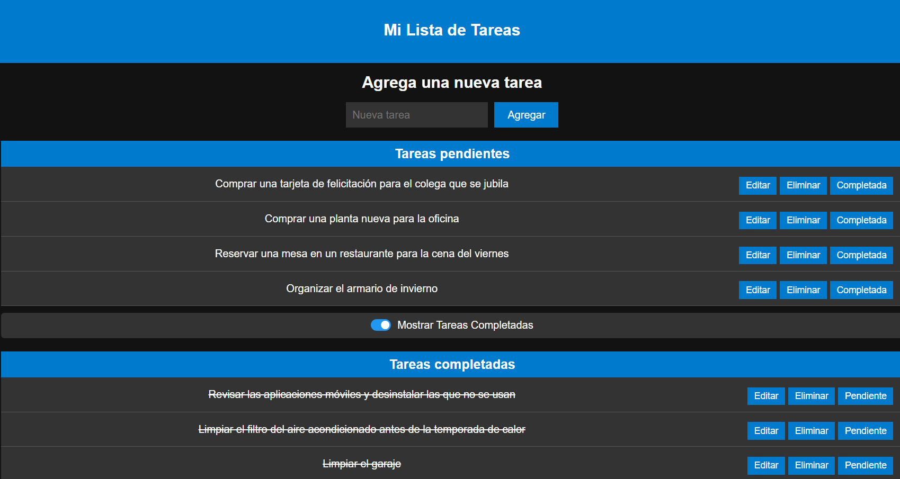
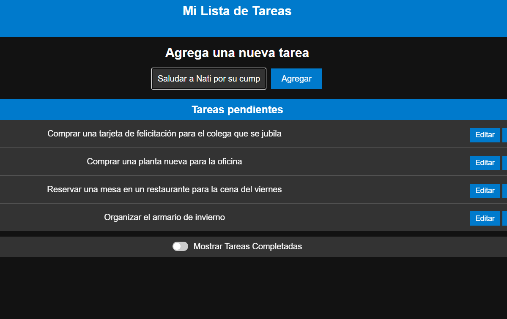

# **App Tareas Javier**  

¡Organiza tus tareas de manera rápida y sencilla!  
**Prueba la aplicación ahora mismo de forma TOTALMENTE GRATUITA en:**  
👉 [https://apptareas.muruadev.com/](https://apptareas.muruadev.com/)  

---

## **🎯 Características principales**
- **Simplicidad al máximo**: Interfaz amigable e intuitiva para que cualquier usuario pueda usarla sin curva de aprendizaje.
- **Gestión completa de tareas**:  
  - Agrega, edita y elimina tareas fácilmente.
  - Marca tareas como completadas o pendientes con un solo clic.
  - Visualiza tus tareas pendientes y decide si deseas ocultar o mostrar las completadas.
- **Datos siempre disponibles**: Todas las tareas se guardan automáticamente en el navegador mediante `localStorage`, asegurando su persistencia entre sesiones.

> **⚠️ Nota importante:** Si borras el caché de tu navegador, las tareas almacenadas se eliminarán. [Más información](https://muruadev.com/preguntas-frecuentes-app-tareas/)

---

## **🚀 ¿Por qué usar esta aplicación?**
- **Ideal para el día a día:** Perfecta para realizar listas rápidas de tareas o recordatorios.
- **Sin necesidad de instalación:** Simplemente abre la aplicación en tu navegador y comienza a usarla.
- **¡Directamente accesible en línea!**: Usa la aplicación sin configurar nada en [https://apptareas.muruadev.com/](https://apptareas.muruadev.com/).
- **Completamente gratuita y de código abierto:** Aprende cómo funciona y modifícala según tus necesidades.

---

## **🛠️ Tecnologías usadas**
Esta aplicación utiliza las siguientes tecnologías y dependencias clave:  
- **React**: Biblioteca para construir interfaces de usuario dinámicas.  
  - Versión: `^18.2.0`
- **React-DOM**: Manejo de estructuras del DOM en aplicaciones React.  
  - Versión: `^18.2.0`
- **Vite**: Herramienta de desarrollo rápido que optimiza la carga de módulos.  
  - Versión: `^4.4.5`
- **ESLint**: Linter para garantizar la calidad del código.  
  - Versión: `^8.45.0`
- **Plugins relacionados**:  
  - `@vitejs/plugin-react`: `^4.0.3`
  - `eslint-plugin-react`: `^7.32.2`
  - `eslint-plugin-react-hooks`: `^4.6.0`

Además, se utilizan las siguientes herramientas para tipado y ayuda al desarrollo:  
- **@types/react**: `^18.2.15`
- **@types/react-dom**: `^18.2.7`

---

## **📋 Instalación y uso local**
### **Requisitos previos**
- Tener instalado [Node.js](https://nodejs.org/) (versión recomendada: 16 o superior).
- Un navegador moderno como Chrome, Firefox, Edge o Safari.

### **Pasos para clonar y ejecutar el proyecto localmente**
1. **Clona el repositorio:**
   ```bash
   git clone https://github.com/tuusuario/app-tareas-javier.git
   ```
2. **Accede al directorio del proyecto:**
   ```bash
   cd app-tareas-javier
   ```
3. **Instala las dependencias:**
   ```bash
   npm install
   ```
4. **Inicia el servidor de desarrollo:**
   ```bash
   npm run dev
   ```
5. Abre tu navegador y accede a la URL indicada (por lo general, `http://localhost:5173`).

---

## **🖼️ Capturas de pantalla**





---

## **🤝 Contribuciones**
¿Tienes ideas para mejorar esta aplicación? ¡Estaré encantado de recibir tus aportes!  
1. Haz un _fork_ del proyecto.
2. Crea una rama para tu funcionalidad o mejora:
   ```bash
   git checkout -b mejora-nueva-funcionalidad
   ```
3. Envía un **pull request** cuando estés listo.

---

## **📄 Licencia**
Este proyecto está bajo la licencia [MIT](https://opensource.org/licenses/MIT), lo que significa que eres libre de usar, modificar y distribuir el código, siempre que incluyas la atribución correspondiente.

---

¡No esperes más! Organiza tus tareas fácilmente desde cualquier dispositivo.  
👉 **Accede a la aplicación ahora:** [https://apptareas.muruadev.com/](https://apptareas.muruadev.com/)
